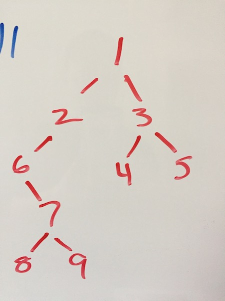

# Binary Tree 

**Author** Kris Sakarias

**Version** 1.0.0

## Overview
This is an implementation of a binary tree. This data structure is merely constructed with a single root node. Each node can have a left and right child node that branch off from eachother from the root node. 

## Documentation
An instance of the Binary tree can be instantiated by: `const tree = new BinaryTree()`. 
The tree has three prototypal traversal methods:

```
preOrderTraversal()
postOrderTraversal()
inOrderTraversal()
```

### Consider the tree: 



#### tree.preOrderTraversal()
The pre-order traversal method traverses the binary tree in the `Root - Left - Right` pattern, and will for the above tree return `1,2,6,7,8,9,3,4,5`.

#### tree.postOrderTraversal()
The pre-order traversal method traverses the binary tree in the `Left - Right - Root` pattern, and will for the above tree return `8,9,7,6,2,4,5,3,1`. 

#### tree.inOrderTraversal()
The pre-order traversal method traverses the binary tree in the `Left - Root - Right` pattern, and will for the above tree return `6,8,7,9,2,1,4,3,5`.

## Tests
To run tests:

1. ```git clone https://github.com/kris71990/15-stacks```
2. ```npm i```
3. ```npm run test```
